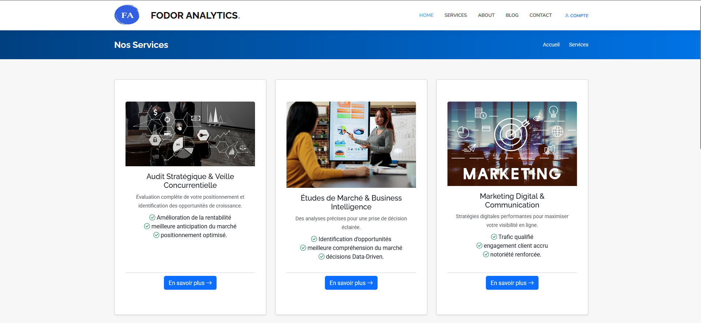

# GABITHEX - Web Application

## Description
GABITHEX Web App est une application web développée avec Django. Elle est conçue pour gérer et afficher des informations sur les services, les clients, les projets, les témoignages et bien plus encore. Cette application est développée avec une approche dynamique et modulaire, permettant à l'administrateur de modifier tous les éléments (contenu) depuis l'espace admin.

## Aperçu
### Capture d'écran du site 🔗 **Lien vers le site :** [GABITHEX Consulting Web App](https://www.gabithex.fr/)



### Diagramme de la base de données


## Fonctionnalités
- Gestion des services offerts par l'entreprise
- Présentation des projets réalisés
- Gestion des témoignages clients
- Carrousel dynamique pour la page d'accueil
- Administration via Django Admin
- Rédaction d'articles de blog
- Gestion du portfolio pour les membres de l'équipe

## Structure du projet
Le projet est organisé comme suit [Structure hiérarchique du projet Django](https://gitingest.com/kossaiRedou/ConsultingStartup-Web_App)

## Prérequis

Pour réussir, assurez-vous d'avoir des connaissances en programmation Python et en langages front-end comme HTML, CSS et Bootstrap 5.

- Python 3.12
- Django
- Bootstrap

## Installation et exécution

1. Clonez le dépôt :

   ```sh
   git clone <lien-du-repo>
   cd kossairedou-consultingstartup-web_app/KOTO/

## Licence

Ce projet est sous licence MIT.
